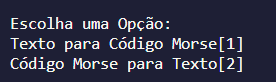
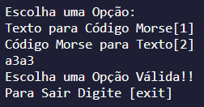
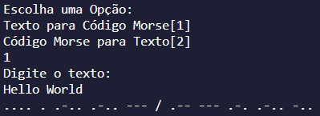
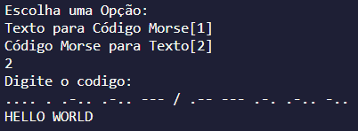

# Tradutor de código Morse

## 📌 Sobre

Tradutor de Código Morse com a opção de Morse para Texto e de Texto para o Código Morse.

&nbsp;

## ⚙ Ultilização

O usuário terá que digitar uma opção de sua escolha:

&nbsp;

Em situações de opção inválida e entrada não numéricas:

&nbsp;

Opção de texto para Código Morse:

&nbsp;

Opção de Morse para texto:

